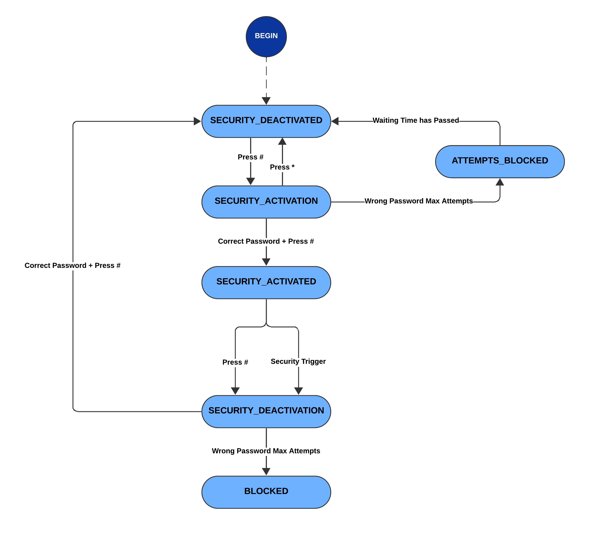

# Arduino FreeRTOS Security System

A modular security alarm built with a Finite State Machine (FSM) on Arduino Mega 2560, designed for an Embedded Systems project using FreeRTOS. It features a 16x2 LCD, Keypad, and multi-sensor detection. The project uses FreeRTOS primitives (Tasks, Queues, and Software Timers) for concurrent sensor monitoring and non-blocking siren generation.

## Features

* **Access Control**: Arm and disarm the system using a secure 4-digit password (Default: `8086`).
* **Password Security**:
    * Input masking (shows `*` on LCD).
    * "C" to clear digits, "D" to toggle password visibility.
    * **Brute-force protection**: System blocks input for 5 seconds after 3 failed attempts.
* **Multi-Sensor Detection**:
    * **Ultrasonic**: Detects proximity/movement anomalies (< 4cm).
    * **Laser Tripwire**: Uses an LDR to detect beam interruption.
    * **Tilt Switch**: Detects physical tampering or movement of the unit.
* **Actuators**:
    * **Servo Lock**: Physically locks (190°) when armed and unlocks (0°) when disarmed.
    * **Laser**: Automatically activates when the system is armed.
* **Feedback**:
    * **LCD**: Displays system status and prompts via a buffered queue system.
    * **Buzzer**: Plays a non-blocking siren melody when an intrusion is detected.
    * **LED**: Visual indicator that lights up when the alarm is triggered.
* **RTOS Architecture**: Utilizes FreeRTOS to decouple input scanning, logic processing, and display rendering.

## Hardware Requirements

* Arduino Mega 2560
* 16x2 LiquidCrystal LCD Display
* 4x4 Matrix Keypad
* Ultrasonic Sensor (HC-SR04)
* Servo Motor (e.g., SG90)
* Laser Diode Module
* LDR (Light Dependent Resistor) Sensor
* Tilt Switch Module
* Piezo Buzzer (Passive)
* LED (e.g., Red)

## Arduino Libraries

Managed via PlatformIO (see `platformio.ini`):

* [**FreeRTOS**](https://github.com/feilipu/Arduino_FreeRTOS_Library) by Richard Barry and Philip Stevens
* [**LiquidCrystal**](https://www.arduino.cc/en/Reference/LiquidCrystal) by Arduino and Adafruit
* [**Keypad**](https://docs.arduino.cc/libraries/keypad) by Mark Stanley and Alexander Brevig
* [**Ultrasonic**](https://docs.arduino.cc/libraries/ultrasonic) by Erick Simões 
* [**Servo**](https://www.arduino.cc/reference/en/libraries/servo/) by Michael Margolis and Arduino

## Project Structure

The source code is organized into modular components:

* `main.cpp`: Initializes the FreeRTOS kernel, defines the Pinout, and creates the three main tasks (`vTaskKeypad`, `vTaskFSM`, `vTaskRefreshDisplay`).
* `FSM.hpp`: Defines the states for the security system (e.g., `SECURITY_ACTIVATED`, `BLOCKED`).
* `Buzzer.hpp` / `.cpp`: A thread-safe audio module. It uses a **Software Timer** and a **Mutex** to play complex melodies without blocking the main execution tasks.
* `debug.hpp`: A macro for conditional serial debugging.

## How It Works

### FreeRTOS Tasks & Queues

The system relies on the scheduler to manage three concurrent tasks:

1.  **`vTaskKeypad`**: Scans the 4x4 matrix keypad every 2 ticks. If a key is pressed, it is sent to the `xKeysQueue`.
2.  **`vTaskFSM`**: The core logic task. It receives data from `xKeysQueue`. It manages the state transitions, validates passwords, checks sensors (Ultrasonic, LDR, Tilt), and controls the Servo/Laser.
3.  **`vTaskRefreshDisplay`**: A dedicated task for updating the LCD. It consumes string buffers from the `xDisplayQueue`. This ensures that slow LCD write operations do not delay sensor readings or keypad inputs.

### Finite State Machine (FSM)

The system logic is driven by `current_state` in the FSM task:

* **SECURITY_DEACTIVATED**: System is idle. Servo is unlocked. Waits for `#` to start arming.
* **SECURITY_ACTIVATION**: User enters the password to arm.
* **SECURITY_ACTIVATED**: System is Armed. Servo is locked, Laser is ON. The task actively monitors sensors (`xVerifySensors`). If a sensor triggers, it moves to `SECURITY_DEACTIVATION` and sounds the alarm.
* **SECURITY_DEACTIVATION**: User enters password to disarm or stop the alarm.
* **ATTEMPTS_BLOCKED**: Temporary lockout state after too many wrong passwords.
* **BLOCKED**: Permanent lockout state (requires reset or master intervention) if intrusion is confirmed.

## Pinout Configuration

Defined in `main.cpp`:

| Component | Pin(s) |
| :--- | :--- |
| **LCD (RS, EN, D4-D7)** | 53, 52, 51, 50, 49, 48 |
| **Keypad Rows** | 29, 28, 27, 26 |
| **Keypad Cols** | 25, 24, 23, 22 |
| **Ultrasonic (Trig, Echo)** | 12, 11 |
| **Servo** | 9 |
| **Tilt Switch** | 8 |
| **Laser Diode** | 13 |
| **Alarm LED** | 6 |
| **Buzzer** | 5 |
| **LDR Sensor** | A0 |

## Contributors

* [**RafaelRS04**](https://github.com/RafaelRS04) – **Firmware Developer**: Responsible for the system architecture, firmware development and system implementation.
* [**CarlosE-Ribeiro**](https://github.com/CarlosE-Ribeiro) – **Hardware Concept**: Responsible for the project conception and physical assembly of the circuit.